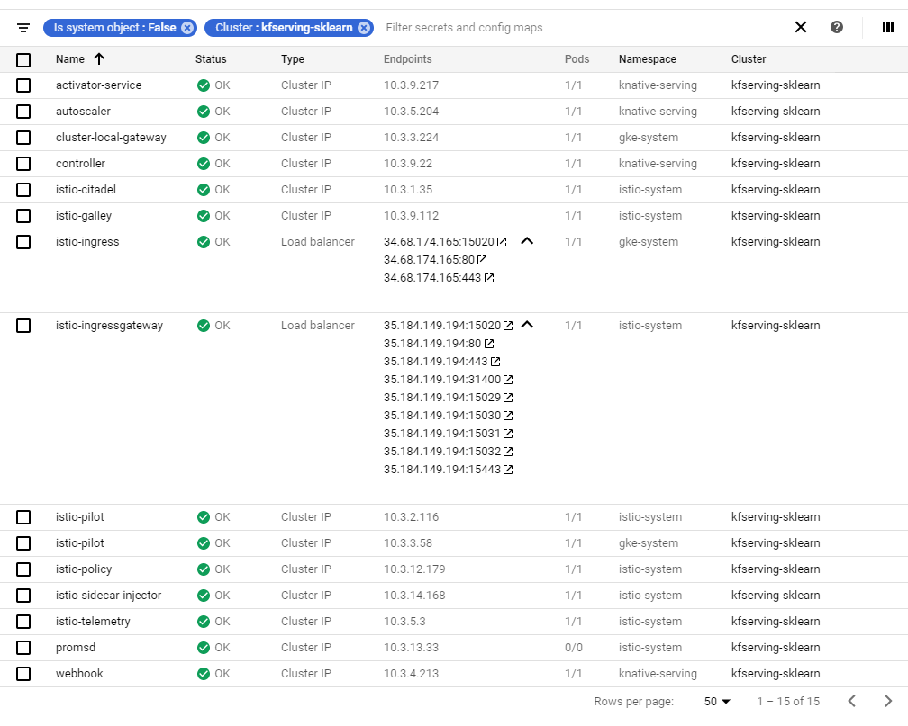

# KF Serving with creating an inference cluster

## 1. Create a cluster, which has `HTTP LoadBalancer`, `Istio`, `Knative`

**Info**: `addons Istio` and install `Knative` manually:It is not working.
Install `CloudRun` to bypass the problem


```sh
# gcloud iam service-accounts add-iam-policy-binding \
#   --role roles/iam.workloadIdentityUser \
#   --member "serviceAccount:cluster_project.svc.id.goog[k8s_namespace/ksa_name]" \
#   gsa_name@gsa_project.iam.gserviceaccount.com

# gcloud iam service-accounts add-iam-policy-binding \
#   --role roles/iam.workloadIdentityUser \
#   --member "serviceAccount:project-id.svc.id.goog[default/default]" \
#   gsa-name@project-id.iam.gserviceaccount.com

# kubectl annotate serviceaccount \
#   --namespace k8s_namespace \
#    ksa_name \
#    iam.gke.io/gcp-service-account=gsa_name@gsa_project.iam.gserviceaccount.com

# Enable Workload Identity on an existing cluster
# **Note**: This action requires `container.clusters.update` permissions on the cluster.
gcloud container node-pools update nodepool-name \
  --cluster=cluster-name \
  --workload-metadata=GKE_METADATA

# Cleaning-up
gcloud container node-pools update nodepool-name \
  --cluster=cluster-name \
  --workload-metadata=GCE_METADATA

```

<https://cloud.google.com/kubernetes-engine/docs/concepts/private-cluster-concept#overview>
```bash
NETWORK="yjkim-vpc"  # "default" or VPC
SUBNETWORK="yjkim-kube-subnet"

CLUSTER_NM="kfserving-test"
REGION="us-central1"
#ZONE="us-central1-f"
CLUSTER_VERSION="1.15.9-gke.24"
MASTER_IPV4_CIDR="192.168.1.32/28"
CLUSTER_IPV4_CIDR="192.168.0.0/16"  # The IP address range for the pods in this cluster
SERVICE_IPV4_CIDR="172.16.0.0/16"  # Set the IP range for the services IPs. Can be specified as a netmask size (e.g. '/20') or as in CIDR notion (e.g. '10.100.0.0/20').  Can not be specified unless '--enable-ip-alias' is also specified.
DISK_TYPE="pd-standard"  #  pd-standard, pd-ssd
DISK_SIZE="100GB"  # default: 100GB
IMAGE_TYPE="UBUNTU"  # COS, UBUNTU, COS_CONTAINERD, UBUNTU_CONTAINERD, WINDOWS_SAC, WINDOWS_LTSC (gcloud container get-server-config)
MACHINE_TYPE="n1-standard-2" # (gcloud compute machine-types list)

# #--- [GPUs]: Check AZ for GPU model Availability <https://cloud.google.com/compute/docs/gpus#gpus-list> ---#
# # (gcloud compute accelerator-types list) ,count: default 1

# # 1. {Tesla T4: (us-central1-a, us-central1-b, us-central1-f), (asia-northeast3-b, asia-northeast3-c)}
# ACCELERATOR="type=nvidia-tesla-t4,count=1"
# ZONE_NODE_LOCATIONS="us-central1-a,us-central1-b,us-central1-f"

# # 2. {Tesla K80: (us-central1-a, us-central1-c)}
# ACCELERATOR="type=nvidia-tesla-k80,count=1"
# ZONE_NODE_LOCATIONS="us-central1-a,us-central1-c"

# # 3. {Tesla P100: (us-central1-c, us-central1-f)}
# ACCELERATOR="type=nvidia-tesla-p100,count=1"
# ZONE_NODE_LOCATIONS="us-central1-c,us-central1-f"

# # 4. {Tesla V100: (us-central1-a, us-central1-b, us-central1-c, us-central1-f)}
# ACCELERATOR="type=nvidia-tesla-v100,count=1"
# ZONE_NODE_LOCATIONS="us-central1-a,us-central1-b,us-central1-c,us-central1-f"

# #----------------------------------------------------------------------------------------------------------#

NUM_NODES="2"  # default: 3
#MAX_NODES  # Ignored unless `--enable-autoscaling` is also specified.
#MIN_NODES  # Ignored unless `--enable-autoscaling` is also specified.
MAX_NODES_PER_POOL="10"  # Defaults to 1000 nodes, but can be set as low as 100 nodes per pool on initial create.
MAX_PODS_PER_NODE="110"  # default=110, Must be used in conjunction with '--enable-ip-alias'.
NETWORK="yjkim-vpc"  # "default" or VPC
SUBNETWORK="yjkim-kube-subnet"
TAGS="yjkim-kube-instance,"  # (https://cloud.google.com/compute/docs/labeling-resources), tag1,tag2
SERVICE_ACCOUNT="yjkim-kube-admin-sa@ds-ai-platform.iam.gserviceaccount.com"
WORKLOAD_POOL="" # Enable Workload Identity on the cluster. When enabled, Kubernetes service accounts will be able to act as Cloud IAM Service Accounts, through the provided workload pool. Currently, the only accepted workload pool is the workload pool of the Cloud project containing the cluster, `PROJECT_ID.svc.id.goog.`
#--security-group=SECURITY_GROUP  # The name of the RBAC security group for use with Google security groups in Kubernetes RBAC (https://kubernetes.io/docs/reference/access-authn-authz/rbac/). If unspecified, no groups will be returned for use with RBAC.
ISTIO_CONFIG="auth=MTLS_PERMISSIVE"
METADATA="disable-legacy-endpoints=true"
LABELS="cz_owner=youngju_kim,application=kubeflow"
DESCRIPTION="A testbed Kubernetes cluster;for Kubeflow, KFServing, NVIDIA Runtime, etc."
SOURCE_NETWORK_CIDRS=""

gcloud beta container clusters create \
    $CLUSTER_NM \
    --region=$REGION \
    --zone=$ZONE \
    #--workload-pool=$WORKLOAD_POOL \
    --cluster-version=$CLUSTER_VERSION \
    --enable-ip-alias \
    #--enable-private-endpoint \
    --enable-private-nodes \
    --no-enable-master-authorized-networks \
    # --enable-master-global-access \
    # --enable-master-authorized-networks \
    #   --master-authorized-networks=SOURCE_NETWORK_CIDRS \
    --master-ipv4-cidr=$MASTER_IPV4_CIDR \
    --cluster-ipv4-cidr=$CLUSTER_IPV4_CIDR \
    --services-ipv4-cidr=$SERVICE_IPV4_CIDR \
    --disk-type=$DISK_TYPE \
    --disk-size=$DISK_SIZE \
    --image-type=$IMAGE_TYPE \
    --machine-type=$MACHINE_TYPE \
    #--accelerator=ACCELERATOR \
    #--node-locations=$ZONE_NODE_LOCATIONS \
    --num-nodes=$NUM_NODES \
    --max-nodes-per-pool=$MAX_NODES_PER_POOL \
    --max-pods-per-node=$MAX_PODS_PER_NODE \
    --network=$NETWORK \
    --subnetwork=$SUBNETWORK \
    --tags=$TAGS \
    --service-account=$SERVICE_ACCOUNT \
    --shielded-integrity-monitoring \
    --metadata=$METADATA \
    --description=$DESCRIPTION \
    --labels=$LABELS \
    --addons HorizontalPodAutoscaling,HttpLoadBalancing,Istio,CloudRun \
    --istio-config=$ISTIO_CONFIG \
    --enable-stackdriver-kubernetes \
    --enable-autoscaling \
    --enable-vertical-pod-autoscaling \
    --enable-autorepair \
    --no-enable-autoupgrade \
    --enable-intra-node-visibility  # It makes your intra-node pod-to-pod traffic visible to the networking fabric
    --enable-shielded-nodes \
    --scopes="gke-default"
```


> `--metadata=KEY=VALUE,[KEY=VALUE,…]`(--metadata key-1=value-1,key-2=value-2,key-3=value-3)
> Additionally, the following keys are reserved for use by Kubernetes Engine:
> * cluster-location
> * cluster-name
> * cluster-uid
> * configure-sh
> * enable-os-login
> * gci-update-strategy
> * gci-ensure-gke-docker
> * instance-template
> * kube-env
> * startup-script
> * user-data

Show the `current-context`:
```bash
kubectl config current-context
```

or select it:

```bash
gcloud container clusters get-credentials $CLUSTER_NM \
  --region $ZONE
  #--project ds-ai-platform
```

Result:


### 2
```bash
kubectl apply -f - <<EOF
apiVersion: networking.istio.io/v1alpha3
kind: VirtualService
metadata:
  name: health
  namespace: knative-serving
spec:
  gateways:
  - gke-system-gateway
  hosts:
  - "*"
  http:
  - match:
    - headers:
        user-agent:
          prefix: GoogleHC
      method:
        exact: GET
      uri:
        exact: /
    rewrite:
      authority: istio-ingressgateway.istio-system.svc.cluster.local:15020
      uri: /healthz/ready
    route:
    - destination:
        host: istio-ingressgateway.istio-system.svc.cluster.local
        port:
          number: 15020
EOF
```

### 3-1, 3-2
```sh
cat <<EOF > istio-ingressgateway-patch.json
[
  {
    "op": "replace",
    "path": "/spec/type",
    "value": "NodePort"
  },
  {
    "op": "remove",
    "path": "/status"
  }
]
EOF
kubectl -n istio-system patch svc istio-ingressgateway \
    --type=json -p="$(cat istio-ingressgateway-patch.json)" \
    --dry-run=true -o yaml | kubectl apply -f -
kubectl annotate svc istio-ingressgateway -n istio-system cloud.google.com/neg='{"exposed_ports": {"80":{}}}'
```

### 3-3. Creating a Kubernetes Ingress object

* HTTP
```bash
kubectl apply -f - <<EOF
apiVersion: extensions/v1beta1
kind: Ingress
metadata:
  name: my-ingress-http
  namespace: istio-system
spec:
  backend:
    serviceName: istio-ingressgateway
    servicePort: 80
EOF
```

```bash
kubectl get ingress -n istio-system
INGRESS_NM="my-ingress-http"
INGRESS_IP=$(kubectl get ingress ${INGRESS_NM} -n istio-system \
    --output jsonpath='{.status.loadBalancer.ingress[0].ip}')
```

## 4. Install `KFServing`

```bash
TAG=0.2.2 && \
wget https://raw.githubusercontent.com/kubeflow/kfserving/master/install/$TAG/kfserving.yaml \
    -O "kfserving-${TAG}.yaml"
kubectl apply -f "kfserving-${TAG}.yaml"
```

## 5. Set `inferenceservice`

```bash
curl -fsSL https://raw.githubusercontent.com/kubeflow/kfserving/master/docs/samples/sklearn/sklearn.yaml -O
kubectl apply -f sklearn.yaml
```

## 6. Get a prediction

```bash
curl -fsSL https://raw.githubusercontent.com/kubeflow/kfserving/master/docs/samples/sklearn/iris-input.json -O

MODEL_NAME=sklearn-iris
INPUT_PATH=@./iris-input.json
CLUSTER_IP=$(kubectl -n istio-system get service istio-ingressgateway -o jsonpath='{.status.loadBalancer.ingress[0].ip}')
sleep 20s
SERVICE_HOSTNAME=$(kubectl get inferenceservice sklearn-iris -o jsonpath='{.status.url}' | cut -d "/" -f 3)
curl -v -H "Host: ${SERVICE_HOSTNAME}" http://$CLUSTER_IP/v1/models/$MODEL_NAME:predict -d $INPUT_PATH
```

Then, the output would be the following:
```ascii
* Expire in 0 ms for 6 (transfer 0x56322055d560)
*   Trying 104.154.142.146...
* TCP_NODELAY set
* Expire in 200 ms for 4 (transfer 0x56322055d560)
* Connected to 104.154.142.146 (104.154.142.146) port 80 (#0)
> POST /v1/models/sklearn-iris:predict HTTP/1.1
> Host: sklearn-iris.default.example.com
> User-Agent: curl/7.64.0
> Accept: */*
> Content-Length: 76
> Content-Type: application/x-www-form-urlencoded
>
* upload completely sent off: 76 out of 76 bytes
< HTTP/1.1 200 OK
< content-length: 23
< content-type: text/html; charset=UTF-8
< date: Thu, 07 May 2020 18:19:23 GMT
< server: istio-envoy
< x-envoy-upstream-service-time: 8105
<
* Connection #0 to host 104.154.142.146 left intact
{"predictions": [1, 1]}%
```

Done.

---

## 3-2, 3-3. Add Other port to `ingressgateway`

* HTTP
```bash
kubectl apply -f - <<EOF
apiVersion: extensions/v1beta1
kind: Ingress
metadata:
  name: my-ingress-http
  namespace: istio-system
spec:
  backend:
    serviceName: istio-ingressgateway
    servicePort: 80
EOF
```
spec:
  clusterIP: 10.3.15.10
  externalTrafficPolicy: Cluster
  ports:
  - name: status-port
    nodePort: 31017
    port: 15020
    protocol: TCP
    targetPort: 15020
  - name: http2
    nodePort: 32195
    port: 80
    protocol: TCP
    targetPort: 80
  - name: https
    nodePort: 30050
    port: 443
    protocol: TCP
    targetPort: 443
**Tip**: Using `kubectl patch` and `{"op": "add"}`
```sh
kubectl patch svc istio-ingress --type='json' \
-p='
[
  {
    "op": "add",
    "path": "/spec/ports",
    "value": {
      "name": "custom-port",
      "nodePort": "",
      "port": "",
      "protocol": "TCP",
      "targetPort": ""
    }
  }
]
'

kubectl patch svc istio-ingressgateway --type='json' \
-p='
[
  {
    "op": "add",
    "path": "/spec/ports",
    "value": {
      "name": "custom-port",
      "nodePort": "",
      "port": "",
      "protocol": "TCP",
      "targetPort": ""
    }
  }
]
'

```

Next Step: **Using `sidecar injection` with `Istio`**

Further Readings about **Sidecar Injection**
1. <https://cloud.google.com/istio/docs/istio-on-gke/installing#enabling_sidecar_injection>
2. https://istio.io/docs/setup/additional-setup/sidecar-injection/

Prerequisite: [`istioctl`](../../istio/README.md#install-istioctl)


* gRPC: <https://docs.microsoft.com/ko-kr/aspnet/core/grpc/comparison?view=aspnetcore-3.1>
* gRPC & Envoy <https://cloud.google.com/solutions/exposing-grpc-services-on-gke-using-envoy-proxy>
  * Comparison between AppLB and HTTPsLB: <https://cloud.google.com/solutions/exposing-grpc-services-on-gke-using-envoy-proxy#alternative_ways_to_route_grpc_traffic>
  * GKE gRPC Ingress LoadBalancing: <https://github.com/salrashid123/gcegrpc/tree/master/gke_ingress_lb>
* External LoadBalancer in GKE: <https://cloud.google.com/kubernetes-engine/docs/concepts/network-overview#ext-lb>
* External TCP/UDP LoadBalancer: <https://cloud.google.com/kubernetes-engine/docs/how-to/internal-load-balancing#determining_your_ingress_balancing_mode>