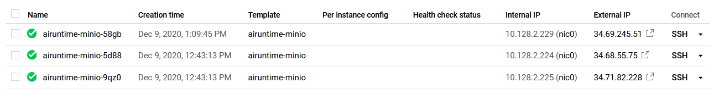
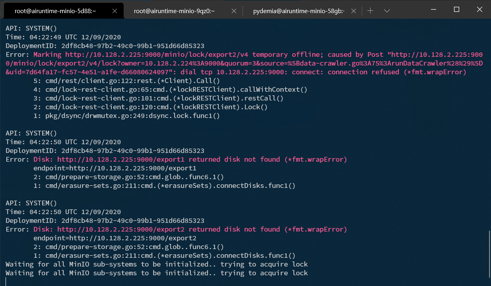
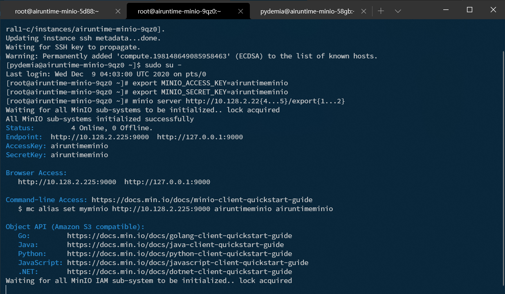
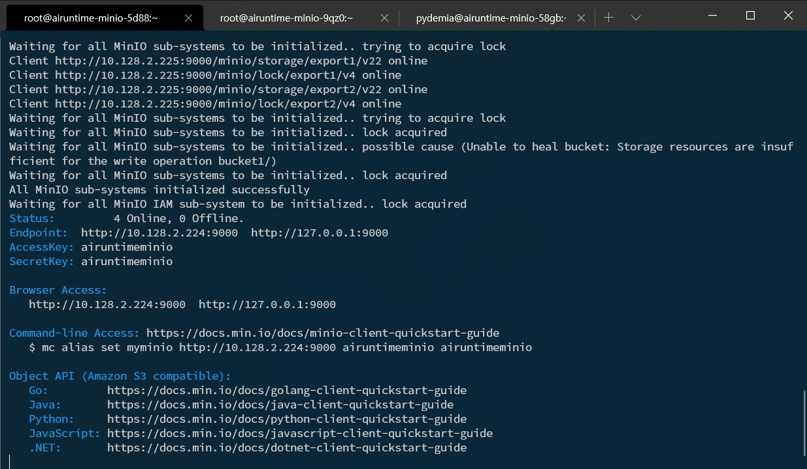
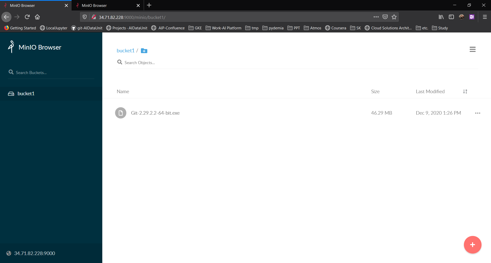
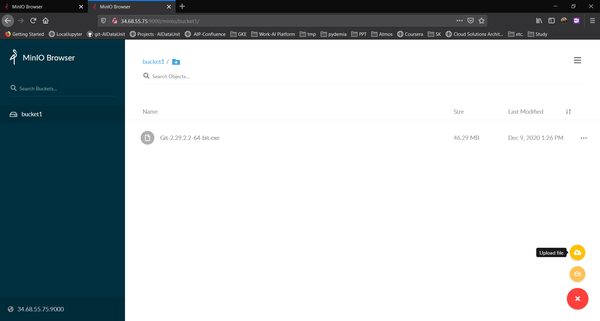

# minIO - Object Storage

## Installation

Source: 
- https://docs.min.io/docs/minio-quickstart-guide.html
- https://min.io/download#/linux

```bash
# wget https://dl.min.io/server/minio/release/linux-amd64/minio
wget https://dl.min.io/server/minio/release/linux-amd64/minio --no-check-certificate
chmod +x minio


lsblk
# NAME   MAJ:MIN RM  SIZE RO TYPE MOUNTPOINT
# sda      8:0    0   20G  0 disk
# ├─sda1   8:1    0  200M  0 part /boot/efi
# └─sda2   8:2    0 19.8G  0 part /
# sdb      8:16   0    1T  0 disk

DEVICE_ID="sdb"
sudo mkfs.ext4 -m 0 -F -E lazy_itable_init=0,lazy_journal_init=0,discard /dev/${DEVICE_ID}

sudo mkdir -p /data/minio
sudo mount -o discard,defaults /dev/sdb /data/minio
sudo chmod a+w /data/minio

# sudo or root permission is needed for /mnt
# ./minio server /data
$ MINIO_ACCESS_KEY=airuntimeminio & \
  MINIO_SECRET_KEY=airuntimeminio & \
  ./minio server /mnt/miniodata


Attempting encryption of all config, IAM users and policies on MinIO backend
Endpoint:  http://192.168.10.100:9000  http://172.17.0.1:9000  http://172.18.0.1:9000  http://172.26.0.1:9000  http://127.0.0.1:9000
AccessKey: airuntimeminio
SecretKey: airuntimeminio

Browser Access:
   http://192.168.10.100:9000  http://172.17.0.1:9000  http://172.18.0.1:9000  http://172.26.0.1:9000  http://127.0.0.1:9000

Command-line Access: https://docs.min.io/docs/minio-client-quickstart-guide
   $ mc alias set myminio http://192.168.10.100:9000 airuntimeminio airuntimeminio

Object API (Amazon S3 compatible):
   Go:         https://docs.min.io/docs/golang-client-quickstart-guide
   Java:       https://docs.min.io/docs/java-client-quickstart-guide
   Python:     https://docs.min.io/docs/python-client-quickstart-guide
   JavaScript: https://docs.min.io/docs/javascript-client-quickstart-guide
   .NET:       https://docs.min.io/docs/dotnet-client-quickstart-guide

```

(Optional) run in docker

```bash
docker run -p 9000:9000 \
  -e "MINIO_ACCESS_KEY=airuntimeminio" \
  -e "MINIO_SECRET_KEY=airuntimeminio" \
  minio/minio server /data
```

## TLS Setting
https://docs.minio.io/docs/how-to-secure-access-to-minio-server-with-tls.html


## Set Data Protection (MinIO Erasure Code)

Source: https://docs.minio.io/docs/minio-erasure-code-quickstart-guide.html

```bash
docker run -p 9000:9000 --name minio \
  -e "MINIO_ACCESS_KEY=airuntimeminio" \
  -e "MINIO_SECRET_KEY=airuntimeminio" \
  -v /mnt/minio/data1:/mnt/data1 \
  -v /mnt/minio/data2:/mnt/data2 \
  -v /mnt/minio/data3:/mnt/data3 \
  -v /mnt/minio/data4:/mnt/data4 \
  -v /mnt/minio/data5:/mnt/data5 \
  -v /mnt/minio/data6:/mnt/data6 \
  -v /mnt/minio/data7:/mnt/data7 \
  -v /mnt/minio/data8:/mnt/data8 \
  minio/minio server /mnt/data{1...8}
```

#### Test: ~~Flexible Mount~~ Failed

1. Start MinIO

```bash
docker run -p 9000:9000 --name minio \
  -e "MINIO_ACCESS_KEY=airuntimeminio" \
  -e "MINIO_SECRET_KEY=airuntimeminio" \
  -v /mnt/minio/data1:/mnt/data1 \
  -v /mnt/minio/data2:/mnt/data2 \
  -v /mnt/minio/data3:/mnt/data3 \
  -v /mnt/minio/data4:/mnt/data4 \
  minio/minio server /mnt/data{1...4}
```


2. Create 2 buckets, and stop MinIO container


3. restart MinIO container, with different volume setting

```bash
docker container restart minio
```

```bash
docker run -p 9000:9000 --name minio \
  -e "MINIO_ACCESS_KEY=airuntimeminio" \
  -e "MINIO_SECRET_KEY=airuntimeminio" \
  -v /mnt/minio/data1:/mnt/data1 \
  -v /mnt/minio/data2:/mnt/data2 \
  -v /mnt/minio/data3:/mnt/data3 \
  -v /mnt/minio/data4:/mnt/data4 \
  -v /mnt/minio/data5:/mnt/data5 \
  -v /mnt/minio/data6:/mnt/data6 \
  -v /mnt/minio/data7:/mnt/data7 \
  -v /mnt/minio/data8:/mnt/data8 \
  minio/minio server /mnt/data{1...8}
```

## Set Distributed MinIO Erasure Code for Expandibility

Source: https://docs.minio.io/docs/distributed-minio-quickstart-guide.html

> NOTE: **Each zone you add must have the same erasure coding set size as the original zone**, so the same data redundancy SLA is maintained.
> For example, if **your first zone was 8 drives**, you could add further server sets of **16, 32 or 1024 drives each**. All you have to make sure is deployment SLA is multiples of original data redundancy SLA i.e 8.

1. Set Multi nodes


2. Run MinIO in each node

add hosts to `/etc/hosts` of each node:

```ascii
10.128.2.224 airuntime-minio-1
10.128.2.225 airuntime-minio-2
```

**MINIO_ACCESS_KEY**, **MINIO_SECRET_KEY** should be set as environment variables and run the same minio server command respectively.

```bash
wget https://dl.min.io/server/minio/release/linux-amd64/minio --no-check-certificate
chmod +x minio
mv minio /usr/local/bin

export MINIO_ACCESS_KEY=airuntimeminio
export MINIO_SECRET_KEY=airuntimeminio
minio server http://airuntime-minio-{1...2}/data/minio/{1...2}
```




After all nodes are set:


3. Upload a file to test




4. Stop and Add an additional node

add hosts to `/etc/hosts` of each node:

```ascii
10.128.2.224 airuntime-minio-1
10.128.2.225 airuntime-minio-2
10.128.2.226 airuntime-minio-3
10.128.2.229 airuntime-minio-4
```

```bash
export MINIO_ACCESS_KEY=airuntimeminio
export MINIO_SECRET_KEY=airuntimeminio
minio server http://airuntime-minio-{1...2}/data/minio/{1...2} http://airuntime-minio-{3...4}/data/minio/{3...4}
```